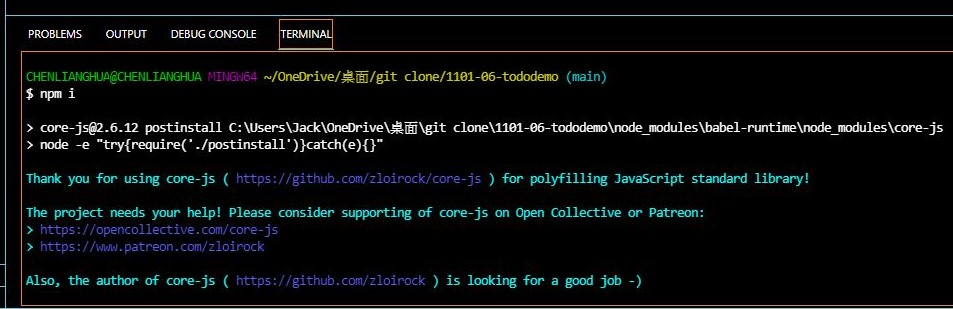

## 9 月 30 日 Web 程式設計 回家作業 

## 1.

components 截圖

> 

> 

### 2.

### repository 截圖

### Github page 設定之截圖

### [repository 連結](https://1013lianghua.github.io/1101-06-tododemo/)

## 4.

### git clone git-repo-url 下載

> 

### 用 npm install 安裝 node_modules 的畫面

> 

## 5.

### chrome 執行畫面

##### modal_06 原始程式碼

>

     

      
{props.text}

      <button className='btn btn--alt' onClick={props.onClose}>
        Cancel
      </button>
      <button className='btn' onClick={props.onClose}>
        Confirm
      </button>
    

>

##### Backdrop_06 原始程式碼

> function Backdrop(props) {
> return 
;
> }
> export default Backdrop;

